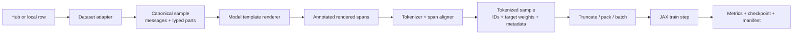

# Architecture

## 1. System boundary

JAXSFT owns the path from an immutable model/dataset reference to a
reproducible SFT checkpoint and run record. It does not own model serving,
online tool execution, preference/RL training, or a general cluster scheduler.

The central rule is that semantic information may be refined as data moves
rightward, but it may not be guessed back from token IDs after it is discarded.



Each arrow has a typed, versioned contract and can be inspected independently.

## 2. Components and ownership

### `data.adapters`

Owns source syntax only. An adapter maps one row to zero, one, or multiple
canonical samples plus diagnostics. It may parse a source's JSON-encoded tool
arguments or rename roles, but it may not add model control tokens, call a chat
template, truncate, or decide global loss normalization.

Built-ins cover common families. A user adapter is an import path such as
`research.my_dataset:adapt_row`, captured by content hash in the run manifest.

### `data.ir`

Owns the versioned canonical representation: sample identity/provenance,
messages, typed parts, tool schemas, call IDs, and attributes. This is a narrow
interchange format, not a claim that all raw datasets share one schema.

### `data.render`

Owns model/tokenizer dialect. A renderer turns a canonical sample into ordered
text/control spans while retaining a reference from each span to its semantic
origin. Tool schema placement, whitespace, start/end markers, reasoning tags,
and generation prompts belong here.

### `tokenizer`

Owns the pinned tokenizer snapshot, exact encoding, span-to-token alignment,
BOS/EOS behavior, template parity, and decoded audit views. It produces token
weights aligned to the token being predicted, not the preceding logit position.

### `data.pack`

Owns length policy, deterministic sample packing, document/sequence segment
IDs, optional position resets, and padding. It does not choose loss weights.

### `models.<architecture>`

Owns one architecture's complete model-specific behavior: config normalization,
parameter initialization and forward pass, Hugging Face checkpoint mapping,
capabilities, auxiliary losses, and logical partition rules. Cross-model imports
are forbidden. Shared math primitives live in `models.common` only after two
implementations prove they are truly shared.

### `loss`

Owns numerically stable causal cross-entropy, vocabulary sharding, label
smoothing, z-loss, semantic grouping, and numerator/denominator reduction. It
consumes explicit target weights; it never infers assistant spans from tokens.

### `train_sft.py`

Owns the readable experiment loop: distributed initialization, mesh creation,
model/optimizer construction, compilation, data iteration, accumulation,
update, evaluation, logging, and checkpoint calls. It may use small utilities,
but the experimental algorithm remains visible in this file.

### `cluster`

Owns controller-side resolution/probe, source capsule creation, synchronization,
remote command construction, launch, monitoring, exact-job stop, and artifact
collection. It never creates SSH keys, modifies host-wide policy, guesses a TPU
topology, or decides model sharding.

### `checkpoint` and `run`

Own atomic writes, sharded state persistence, resume validation, run manifests,
and artifact hashes. A checkpoint is not considered valid until a restore test
can reconstruct model, optimizer, RNG, data cursor, and step.

## 3. Dependency direction

```text
train_sft.py
  ├── config / run / checkpoint
  ├── data (adapter -> IR -> render -> tokenize -> pack)
  ├── models (selected model file -> common math)
  ├── loss
  └── mesh

cluster CLI -> run/config + process utilities
tests/parity -> selected model file + Transformers/PyTorch oracle
```

Important constraints:

- `models/` does not import `data/`, trainer, cluster, or Transformers at module
  import time.
- `data/` does not import a concrete model module. It uses a renderer/tokenizer
  capability interface.
- Transformers, PyTorch, and `datasets` are optional compatibility extras, not
  hard dependencies of the JAX train step.
- Cluster utilities do not import JAX on the controller path. A controller
  without an accelerator can still inspect and launch a slice.

## 4. Configuration model

One strict recipe document resolves into six independently hashed sections:

```yaml
schema_version: 1

model:
  architecture: qwen3_5
  repo_id: Qwen/Qwen3.5-0.8B-Base
  revision: dc7cdfe2ee4154fa7e30f5b51ca41bfa40174e68
  dtype: bfloat16
  remat: full_block

data:
  sources: [...]
  renderer: tokenizer_default
  tokenizer_revision: <immutable commit>
  max_length: 4096
  packing: block_diagonal

objective:
  policies: [...]
  normalization: selected_token

optimization:
  method: full
  optimizer: adamw
  learning_rate: 2.0e-5
  schedule: cosine

mesh:
  axes: {data: -1, model: 1, sequence: 1, expert: 1}

run:
  seed: 17
  steps: 1000
  checkpoint_every: 100
  eval_every: 100
```

The example is abbreviated; the complete committed schema is represented by
`configs/recipes/qwen35_0_8b_ultrachat_smoke.yaml`. The loader:

- reject duplicate and unknown keys;
- avoid environment-variable interpolation inside versioned config;
- resolve aliases into canonical values before hashing;
- record both the input document and fully resolved document;
- prevent CLI flags from silently changing semantic data/objective behavior;
- make path and secret injection explicit through the local cluster profile.

Recipe inheritance should stay shallow. Prefer a small `extends: base.yaml` plus
an explicit resolved-config diff over arbitrary recursive merging. Lists replace
by default; they do not concatenate implicitly.

## 5. Run identity and provenance

A run ID should be human-readable plus content-addressed, for example:

```text
20260829-154233-qwen3-tools-7fd24c8a
```

The immutable identity includes:

- repository HEAD, dirty patch, selected untracked file hashes, and source
  capsule hash;
- Python, JAX, jaxlib/libtpu, Flax (if selected), XLA, CUDA/TPU runtime, and
  locked dependency identities;
- input and resolved recipe hashes;
- cluster profile name and measured process/device topology;
- model repo/revision/file manifest, source dtype, conversion version, and
  parameter-tree signature;
- tokenizer repo/revision/file hashes, special-token map, normalized chat
  template, and template hash;
- each dataset repo/revision/config/split/file identity, adapter identity,
  filtering counts, shuffle/mixing policy, and resume cursor;
- objective selector/weight/normalization identity;
- compilation options, mesh, partition rules, seed streams, and checkpoint
  policy.

Credentials, tokens, absolute secret paths, and full raw rows must not be copied
into a public manifest. Sensitive local fields are redacted before hashing the
public view; a private manifest may retain local paths.

## 6. Trainer shape

The canonical trainer is deliberately procedural:

1. parse and validate config without importing accelerator runtime;
2. initialize JAX distributed runtime before any device query;
3. measure and validate topology, then create the named mesh;
4. resolve model/tokenizer/data immutable revisions on the controller path;
5. initialize or restore model, optimizer, RNG streams, and data cursor;
6. create deterministic rank-local iterators and global arrays;
7. compile train/eval steps on synthetic shapes;
8. synchronize all ranks and enter the measured region;
9. for each update, accumulate loss numerator/denominator and gradients across
   microbatches, reduce globally, clip/update, and emit structured metrics;
10. checkpoint atomically at declared boundaries;
11. run deterministic evaluation, synchronize, finalize artifacts, and emit one
    machine-readable result record.

The train step returns additive quantities (loss numerator, selected-token
denominator, token count, examples, and semantic-slice numerators/denominators).
The host never averages already-averaged local losses.

RNG streams are named and derived from the run seed, global update, microbatch,
process index where appropriate, and purpose (`dropout`, `data`, `noise`). The
derivation is part of the checkpoint schema.

## 7. Model loading and memory

The desired loading path is:

1. read pinned `config.json` and safetensors index;
2. build the JAX parameter-tree specification and final shardings;
3. read one tensor/shard at a time;
4. rename/transpose/reshape/cast according to the selected model file;
5. place directly into final or bounded staging buffers;
6. validate every expected and unexpected checkpoint key;
7. record source-to-destination mapping and tree signature.

The loader must perform a preflight estimate for parameters, gradients,
optimizer slots, activations, temporary conversion buffers, and checkpoint
staging. A model can have architecture parity without being advertised as
trainable on the available slice.

## 8. Checkpoint contract

A committed checkpoint directory contains a completion marker written last and
at least:

- schema version and parent run/checkpoint identities;
- step and consumed/selected token counters;
- model parameters and logical/sharding metadata;
- optimizer state and schedule position;
- all RNG state/derivation counters;
- exact data source/mixer/shuffle/packing cursors;
- resolved recipe and topology;
- file manifest with sizes and hashes.

Writes stage under a temporary name and promote atomically where the backend
supports it. A partial checkpoint is visible for diagnosis but never selected
by automatic resume. Multi-host storage semantics must be proven by save,
collection, cold restore, and one continued update.

The implemented schema-v3 baseline is intentionally narrower than this target
contract. For one JAX process (including several local devices), it stores
parameters, AdamW moments/step, the fully resolved recipe identity, exact source
identity, backend/device topology, deterministic RNG cursor, and either a
shape-checked synthetic batch cursor or pinned Hugging Face iterable replay
cursor with tokenizer hash. A SHA-256 completion marker is written last and
checked before a trusted local pickle is opened. The current model has no
dropout, so the RNG record is an explicit derivation cursor rather than
serialized device PRNG state. Multi-process checkpointing fails closed until a
portable shard/storage format is implemented.

## 9. Extension strategy

The common path should remain boring. Research changes use one of four narrow
extensions:

- a dataset adapter (`row -> canonical sample`);
- a renderer (`canonical sample -> annotated spans`);
- a loss policy (`span metadata -> weight/group metadata`);
- an alternate entry program copied from `train_sft.py` for algorithmic work.

All extension source is included in the source capsule. Entry points are import
paths or regular files under the checkout; arbitrary code strings in YAML are
not supported.

## 10. Operational interfaces

The intended command surface is small:

```text
jaxsft data inspect RECIPE --rows 20
jaxsft data explain RECIPE --sample-id ID
jaxsft model parity MODEL_RECIPE
jaxsft cluster doctor --cluster NAME
jaxsft cluster sync --cluster NAME --dry-run
jaxsft run RECIPE --cluster NAME --dry-run
jaxsft run RECIPE --cluster NAME
jaxsft status RUN_ID
jaxsft stop RUN_ID
jaxsft collect RUN_ID
jaxsft checkpoint verify PATH
jaxsft report RUN_ID
```

The top-level `Makefile` will expose the most common exact commands, including
CPU checks, data explanation, local smoke, slice doctor, slice smoke, and
report generation.
